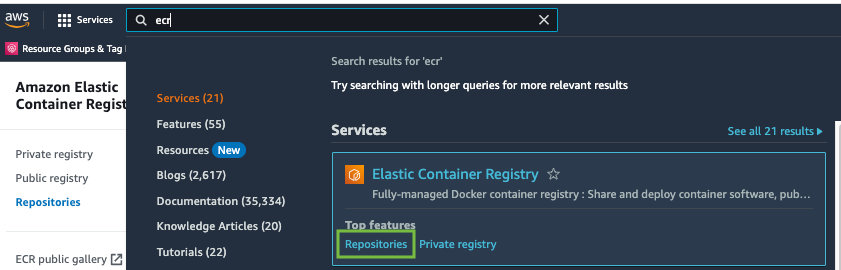

## Objective

In this lab we will login to ECR and push container images.

## Prerequisites

- [Optimizing a Dockerfile with a Multi-stage Build](../../containers/java/multi-stage.md)

## 1. Pushing a container image to Amazon Elastic Container Registry (ECR)

Before we move to deploying containers in different environments, you will push container image to [Amazon Elastic Container Registry (ECR)](https://aws.amazon.com/ecr/).

The Amazon ECR repository with the name `unicorn-store-spring` was already created for you during the workshop setup. It is empty yet, but you can explore it and make yourself familiar with [Amazon ECR](https://console.aws.amazon.com/ecr/home#/) in the AWS console:



To be able to push images to the repository we need to login to the repository:

```bash showLineNumbers
export ECR_URI=$(aws ecr describe-repositories --repository-names unicorn-store-spring | jq --raw-output '.repositories[0].repositoryUri')
echo $ECR_URI
aws ecr get-login-password --region $AWS_REGION | docker login --username AWS --password-stdin $ECR_URI
```

Tag the local container image:

```bash showLineNumbers
IMAGE_TAG=i$(date +%Y%m%d%H%M%S)
echo $IMAGE_TAG
docker tag unicorn-store-spring:latest $ECR_URI:$IMAGE_TAG
docker tag unicorn-store-spring:latest $ECR_URI:latest
docker images
```

Push the image to Amazon ECR:

```bash showLineNumbers
docker push $ECR_URI:$IMAGE_TAG
docker push $ECR_URI:latest
```

Go to the [Amazon ECR](https://console.aws.amazon.com/ecr/home#/)console directly, or navigate to Amazon ECR in the AWS Console. Verify that the image uploaded successfully:


:::info
Image size in Amazon ECR is smaller than locally due to compression
:::

If you change application source code, you can run the set of commands below to build and push a new container image to ECR:

```bash showLineNumbers
cd ~/environment/unicorn-store-spring
docker buildx build --load -t unicorn-store-spring:latest .
IMAGE_TAG=i$(date +%Y%m%d%H%M%S)
docker tag unicorn-store-spring:latest $ECR_URI:$IMAGE_TAG
docker tag unicorn-store-spring:latest $ECR_URI:latest
docker push $ECR_URI:$IMAGE_TAG
docker push $ECR_URI:latest
```

## Conclusion

You successfully containerized Java application and optimized the build behavior and image size. Finally, you pushed the container image to Amazon ECR. With the container image in the AWS Cloud you can now proceed with [Deploy to Amazon EKS](eks/java/eks-create.md).
