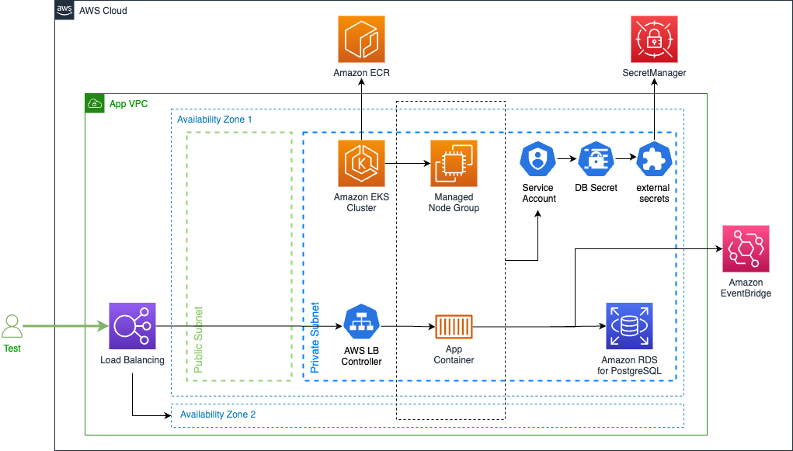
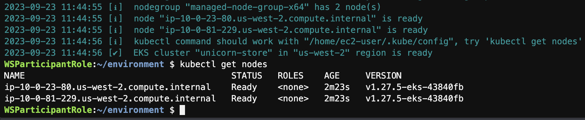

## Objective

Creating an Amazon EKS cluster with [eksctl](https://eksctl.io/) allows for a wide range of configurations to cater to different needs. This lab shows you how to create an Amazon EKS cluster using [eksctl](https://eksctl.io/) and various command line tools.

How does Amazon EKS work?


- Create an Amazon EKS cluster in the AWS Management Console or with the AWS CLI or one of the AWS SDKs.
- Launch managed or self-managed Amazon EC2 nodes, or deploy your workloads to AWS Fargate.
- When your cluster is ready, you can configure your favorite Kubernetes tools, such as kubectl, to communicate with your cluster.
- Deploy and manage workloads on your Amazon EKS cluster the same way that you would with any other Kubernetes environment. You can also view information about your workloads using the AWS Management Console.

## Prerequisites

- [Building and Running Multi-Architecture Containers](../../containers/java/upload-ecr.md)

[Amazon Elastic Kubernetes Service (Amazon EKS)](https://aws.amazon.com/eks/) is a managed service that you can use to run Kubernetes on AWS without needing to install, operate, and maintain your own Kubernetes control plane or nodes. Kubernetes is an open-source system for automating the deployment, scaling, and management of containerized applications.

## 1. Running the UnicornStore with Amazon EKS

Below you can find a visualization on how the UnicornStore application will be deployed and communicate with Amazon EKS:



## 2. Creating an Amazon EKS cluster

[eksctl](https://eksctl.io/) is a simple CLI tool for creating and managing clusters on EKS . It is written in Go, uses CloudFormation and was created by [Weaveworks](https://www.weave.works/).

Get the existing VPC and Subnet IDs to inform EKS where to create the new cluster

```bash showLineNumbers
# Disable Temporary credentials in Cloud9
aws cloud9 update-environment --environment-id $C9_PID --managed-credentials-action DISABLE --region $AWS_REGION &> /dev/null
rm -vf ${HOME}/.aws/credentials  &> /dev/null

export UNICORN_VPC_ID=$(aws cloudformation describe-stacks --stack-name UnicornStoreVpc --query 'Stacks[0].Outputs[?OutputKey==`idUnicornStoreVPC`].OutputValue' --output text)
export UNICORN_SUBNET_PRIVATE_1=$(aws ec2 describe-subnets \
--filters "Name=vpc-id,Values=$UNICORN_VPC_ID" "Name=tag:Name,Values=UnicornStoreVpc/UnicornVpc/PrivateSubnet1" --query 'Subnets[0].SubnetId' --output text)
export UNICORN_SUBNET_PRIVATE_2=$(aws ec2 describe-subnets \
--filters "Name=vpc-id,Values=$UNICORN_VPC_ID" "Name=tag:Name,Values=UnicornStoreVpc/UnicornVpc/PrivateSubnet2" --query 'Subnets[0].SubnetId' --output text)
export UNICORN_SUBNET_PUBLIC_1=$(aws ec2 describe-subnets \
--filters "Name=vpc-id,Values=$UNICORN_VPC_ID" "Name=tag:Name,Values=UnicornStoreVpc/UnicornVpc/PublicSubnet1" --query 'Subnets[0].SubnetId' --output text)
export UNICORN_SUBNET_PUBLIC_2=$(aws ec2 describe-subnets \
--filters "Name=vpc-id,Values=$UNICORN_VPC_ID" "Name=tag:Name,Values=UnicornStoreVpc/UnicornVpc/PublicSubnet2" --query 'Subnets[0].SubnetId' --output text)

aws ec2 create-tags --resources $UNICORN_SUBNET_PRIVATE_1 $UNICORN_SUBNET_PRIVATE_2 \
--tags Key=kubernetes.io/cluster/unicorn-store,Value=shared Key=kubernetes.io/role/internal-elb,Value=1

aws ec2 create-tags --resources $UNICORN_SUBNET_PUBLIC_1 $UNICORN_SUBNET_PUBLIC_2 \
--tags Key=kubernetes.io/cluster/unicorn-store,Value=shared Key=kubernetes.io/role/elb,Value=1

export ACCOUNT_ID=$(aws sts get-caller-identity --output text --query Account)
TOKEN=$(curl -X PUT "http://169.254.169.254/latest/api/token" -H "X-aws-ec2-metadata-token-ttl-seconds: 21600")
export AWS_REGION=$(curl -H "X-aws-ec2-metadata-token: $TOKEN" http://169.254.169.254/latest/dynamic/instance-identity/document | jq -r '.region')

```

Create the cluster with eksctl

```bash showLineNumbers
cd ~/environment
eksctl create cluster \
--name unicorn-store \
--version 1.28 --region $AWS_REGION \
--nodegroup-name managed-node-group-x64 --managed --node-type m5.xlarge --nodes 2 --nodes-min 2 --nodes-max 4 \
--with-oidc --full-ecr-access --alb-ingress-access \
--vpc-private-subnets $UNICORN_SUBNET_PRIVATE_1,$UNICORN_SUBNET_PRIVATE_2 \
--vpc-public-subnets $UNICORN_SUBNET_PUBLIC_1,$UNICORN_SUBNET_PUBLIC_2
```

Wait for the cluster creation

:::info
The creation of the cluster might take around 15 minutes.
:::



Add your IAM role to the list of the EKS cluster administrators to get access from the AWS Console.
Replace --arn `arn:aws:iam::$ACCOUNT_ID:role/Admin` with your role ARN of necessary.

```bash showLineNumbers
eksctl create iamidentitymapping --cluster unicorn-store --region=$AWS_REGION \
    --arn arn:aws:iam::$ACCOUNT_ID:role/Admin --username admin --group system:masters \
    --no-duplicate-arns
```

Get access to the cluster

```bash showLineNumbers
aws eks --region $AWS_REGION update-kubeconfig --name unicorn-store
kubectl get nodes
```

## Conclusion

In this lab we walked you through the process of creating and connecting to an Amazon EKS cluster using managed node groups. By using the eksctl tool you are now better equipped to deploy and manage Kubernetes applications, while AWS takes care of the node lifecycle management.
