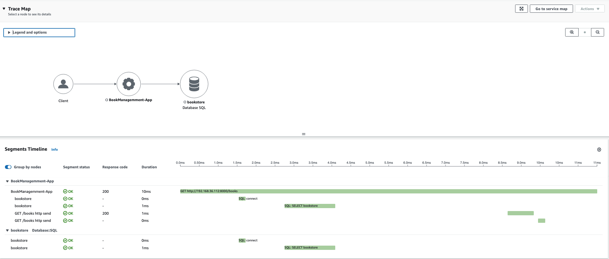

import Tabs from '@theme/Tabs';
import TabItem from '@theme/TabItem';
import GetEnvVars from '../../../src/includes/get-env-vars.md';
import GetECRURI from '../../../src/includes/get-ecr-uri.md';

## Objective

This lab shows you how to instrument the application using AWS Distro for OpenTelemetry (ADOT) and deploy the instrumented application in EKS.
We'll go through the following steps as part of the instrumentation process:

1. Instrument the application code with manual instrumentation in our local environment
2. Test the instrumentation locally
3. Deploy the ADOT add-on in our EKS cluster
4. Deploy the application with the ADOT Collector Side Car Container
5. Visualize request tracing in the AWS X-Ray console

## Prerequisites

* [Securing FastAPI Microservices with Kubernetes Secrets](../python/deploy-secrets.md)
* [Deploying FastAPI and PostgreSQL Microservices to EKS](../python/deploy-app.md)

## 1. Prepare Your Environment

In the `python-fastapi-demo-docker` project where your [environment variables](../../introduction/python/environment-setup) are sourced, check-out the `aws-opentelemetry` branch using the following command:

:::tip
You may receive an error like `error: Your local changes to the following files would be overwritten by checkout` when running the below command if there are changes made to any of the source files. To fix this, first run the command `git stash` and then run the below command. After the checkout is finished, run the command `git stash pop` to reapply the changes.
:::

``` bash
git checkout aws-opentelemetry
```

<Tabs>
  <TabItem value="Fargate" label="Fargate" default>
Next, open the [eks/create-adot-add-on-python-fargate.yaml](https://github.com/aws-samples/python-fastapi-demo-docker/blob/aws-opentelemetry/eks/create-adot-add-on-python-fargate.yaml) file and replace the sample region with the same region as your EKS cluster. For example:
  ```bash
  apiVersion: eksctl.io/v1alpha5
  kind: ClusterConfig
  metadata:
    name: fargate-quickstart
    region: us-west-2
  ```
  </TabItem>
  <TabItem value="Managed Node Groups" label="Managed Node Groups">
  Next, open the [eks/create-adot-add-on-python.yaml](https://github.com/aws-samples/python-fastapi-demo-docker/blob/aws-opentelemetry/eks/create-adot-add-on-python.yaml) file and replace the sample region with the same region as your EKS cluster. For example:

   ```bash
  apiVersion: eksctl.io/v1alpha5
  kind: ClusterConfig
  metadata:
    name: managednode-quickstart
    region: us-west-2
  ``` 

  </TabItem> 
</Tabs>

## 2. Instrument the Application Code with Manual Instrumentation in Local Environment

Otel Instrumentation requires 4 primary steps to get you up and running with OpenTelemetry. Notably, each step is implemented in separate files, including:

* **Global Tracer Provider**: This is the factory for the tracer. It's responsible for creating and managing tracer objects, which in turn helps you to create spans. You'll find the Global Tracer Provider in the [app/tracing.py](https://github.com/aws-samples/python-fastapi-demo-docker/blob/aws-opentelemetry/server/app/tracing.py) file.
* **Processor**: This defines the method of sending the created elements (spans) onwards to the subsequent parts of the system for further processing and exporting. You'll find the configuration for the Processor in the [app/tracing.py](https://github.com/aws-samples/python-fastapi-demo-docker/blob/aws-opentelemetry/server/app/tracing.py) file.
* **Trace Exporter**: This component takes care of sending traces to the OTEL Exporter Endpoint and acts as the bridge. You'll find the Trace Exporter in the [app/tracing.py](https://github.com/aws-samples/python-fastapi-demo-docker/blob/aws-opentelemetry/server/app/tracing.py) file.
* **Instrumenting the Application and Database**: For the FastAPI application, you'll find it's instrumented in the [app/main.py](https://github.com/aws-samples/python-fastapi-demo-docker/blob/aws-opentelemetry/server/app/main.py#L11) file and the PostgreSQL/SQLAlchemy database in the [app/connect.py](https://github.com/aws-samples/python-fastapi-demo-docker/blob/aws-opentelemetry/server/app/connect.py#L47) file.

## 3. Testing the Instrumentation Locally

We’ll be creating a new and improved multi-architecture image in this lab exercise. Remove the existing multi-architecture container you created:

```bash
docker buildx rm webBuilder
```

Alternatively, if you're using Finch, run the following commands to find the image by name and then remove it:

```bash
finch images --filter reference=webbuilder 
finch rmi webbuilder
```

To test the tracing locally, build the instrumented application code locally using the following command:

```bash
docker-compose build 
```

Alternatively, if you're using Finch, run the following command:

```bash
finch compose build
```

docker-compose will use the local image and not the ECR image. In dev set up while doing the changes it is easier to refer to the local image rather than the remote repository image.

Update the `.env` file by adding the following lines:

```bash
# OTLP Specific Configuration
OTEL_EXPORTER_OTLP_ENDPOINT = adotcollector:4317
OTEL_SERVICE_NAME = "BookManagemment-App"
```

Start the application using the following command:

```bash
docker-compose up 
```

Alternatively, if you're using Finch, run the following command to start the application:

```bash
finch compose up
```

Play with the application by adding a couple new books at [http://0.0.0.0:8000](http://0.0.0.0:8000) to generate traces. You can check for traces by opening the X-Ray Tracing page and selecting your AWS Region on the Amazon CloudWatch Console. Click on the "Trace Id" and the "TraceMap" to view traces. For example:


Scroll down to view details of the requests in the trace:


## 4. Build and Push the Multi-Architecture Container

After running a few requests, we'll now push the image to Amazon ECR. First, authenticate the Docker CLI to your Amazon ECR registry using:

```bash
aws ecr get-login-password \
--region ${AWS_REGION} | docker login \
--username AWS \
--password-stdin ${AWS_ACCOUNT_ID}.dkr.ecr.${AWS_REGION}.amazonaws.com
```

Alternatively, if you're using Finch, run the following command to authenticate:

```bash
aws ecr get-login-password \
--region ${AWS_REGION} | finch login \
--username AWS \
--password-stdin ${AWS_ACCOUNT_ID}.dkr.ecr.${AWS_REGION}.amazonaws.com
```

Next, create and start new builder instances for the web service by running the following commands:

```bash
docker buildx create --name webBuilder
docker buildx use webBuilder
docker buildx inspect --bootstrap
```

>Note: There is no direct equivalent for `buildx` using Finch. You can target a set of platforms though.
>The `finch build` command allows targeting different platforms via the `--platform` flag, similar to buildx. You can build binaries for Linux, macOS, and Windows on AMD64 or ARM architectures. For example: `finch build --platform=amd64,arm64 .` to target both AMD and ARM architectures.

Build and push the images for your web service by running the following commands:

```bash
docker buildx use webBuilder
docker buildx build --platform linux/amd64,linux/arm64 -t ${AWS_ACCOUNT_ID}.dkr.ecr.${AWS_REGION}.amazonaws.com/fastapi-microservices:${IMAGE_VERSION} . --push
```

Alternatively, if you're using Finch, we can target the desired platform using the following command:

```bash
finch build --platform=linux/amd64,linux/arm64 -t ${AWS_ACCOUNT_ID}.dkr.ecr.${AWS_REGION}.amazonaws.com/fastapi-microservices:${IMAGE_VERSION} . push=true
```

Display your Amazon ECR URI:

```bash
echo ${AWS_ACCOUNT_ID}.dkr.ecr.${AWS_REGION}.amazonaws.com/fastapi-microservices:${IMAGE_VERSION}
```

Replace the sample image in the [eks/deploy-app-with-adot-sidecar.yaml](https://github.com/aws-samples/python-fastapi-demo-docker/blob/aws-opentelemetry/eks/deploy-app-with-adot-sidecar.yaml#L35) file with your Amazon ECR URI. For example:

```bash
image: 012345678901.dkr.ecr.us-west-1.amazonaws.com/fastapi-microservices:1.0
```

## 5. Deploy the ADOT Add-On

The [`cert-manager`](https://cert-manager.io/docs/) add-on is required for deploying ADOT Add-on. To learn more, see [AWS Distro for OpenTelemetry (ADOT) prerequisites and considerations](https://aws-otel.github.io/docs/getting-started/adot-eks-add-on/requirements) in AWS Otel official documentation.
Deploy the `cert-manager` add-on in your cluster using the following command:

``` bash
kubectl apply -f eks/cert-manager.yaml
```

It would take a minute or two for the pods to deploy successfully.
Verify that 'cert-manager' is ready:

``` bash
kubectl get pod -w -n cert-manager
```

The expected output should look like this:

``` bash
NAME                                       READY   STATUS    RESTARTS   AGE
cert-manager-1234567890-abcde              1/1     Running   0          12s
cert-manager-cainjector-abcdef0123-45678   1/1     Running   0          12s
cert-manager-webhook-021345abcd-ef678      1/1     Running   0          12s
```

Run the following command to install the EKS ADOT add-on:
<Tabs>
 <TabItem value="Fargate" label="Fargate" default>
  ``` bash
  eksctl create addon -f eks/create-adot-add-on-python-fargate.yaml
  ```
 </TabItem>
 <TabItem value="Managed Node Groups" label="Managed Node Groups">

  ``` bash
  eksctl create addon -f eks/create-adot-add-on-python.yaml
  ```
</TabItem>
</Tabs>


### Create the OpenTelemetryCollector Custom Resource Definition (CRD)

Now we'll create the OpenTelemetryCollector CRD object, which contains the configuration required for deploying the OTel Collector as a sidecar container.

First, replace the sample region in the [eks/opentelemetrycollector.yaml](https://github.com/aws-samples/python-fastapi-demo-docker/blob/aws-opentelemetry/eks/opentelemetrycollector.yaml#L34).

Next, run the following command to create the CRD:

``` bash
kubectl apply -f eks/opentelemetrycollector.yaml
```

### Verify the ADOT Collector IAM Roles Service Account (IRSA)

The IRSA for ADOT provides the ADOT collector with "write" permissions to AWS X-Ray. The ADOT collector was configured by eksctl when you created your cluster. You can verify that the ADOT collector service account is configured using the following command:

```bash
kubectl describe serviceaccount -n my-cool-app adot-collector 
```

The expected output should look like this:

``` bash
Name:                adot-collector
Namespace:           my-cool-app
Labels:              app.kubernetes.io/managed-by=eksctl
                     aws-usage=application
Annotations:         eks.amazonaws.com/role-arn: arn:aws:iam::xxxxxx:role/eksctl-managednode-quickstart-addon-iamservi-Role1-1N6RG936O0AC2
Image pull secrets:  <none>
Mountable secrets:   <none>
Tokens:              <none>
Events:              <none>
```

## 6. Deploy the Application with the ADOT Collector Side Car Container

To deploy the add-on with the ADOT side car container, we'll use the  `sidecar.opentelemetry.io/inject: "true"` annotation in our app deployment's pod specification.

First, let's do a little clean up to remove redundant resources. We'll be redeploying these resources with a few additional modifications. Run the following command to delete FastAPI resources:

``` bash
kubectl delete -f eks/deploy-app-python.yaml
```

:::note

Make sure **not** to take any additional steps to delete `fastapi-secret` secret or `fastapi-postgres` database resources you created in previous lab exercises, as these are required for subsequent steps.

:::  

Deploy the new FastAPI application resources using the following command:

``` bash
kubectl apply -f eks/deploy-app-with-adot-sidecar.yaml
```

The expected output should look like this:

```bash
service/fastapi-service created
deployment.apps/fastapi-deployment created
ingress.networking.k8s.io/fastapi-ingress created
```

Run the following command to get the ALB URL:

```bash
kubectl get ingress -n my-cool-app
```

The expected output should look like this:

```bash
NAME              CLASS    HOSTS   ADDRESS                                                                  PORTS   AGE

fastapi-ingress   <none>   *       k8s-mycoolap-fastapii-0114c40e9c-507298630.us-west-1.elb.amazonaws.com   80      2m53s

```

Open a web browser and enter the `ADDRESS` from the previous step to access the web application. For example, `http://k8s-mycoolap-fastapii-0114c40e9c-507298630.us-west-1.elb.amazonaws.com/`. You can check for traces by opening the X-Ray Tracing page and selecting your AWS Region on the Amazon CloudWatch Console. Check for traces in AWS Cloudwatch Console -> X-Ray -> Traces. For example:



We've used 'resourcedetection' in [eks/opentelemetrycollector.yaml](https://github.com/aws-samples/python-fastapi-demo-docker/blob/aws-opentelemetry/eks/opentelemetrycollector.yaml#L22-L25) in the OpenTelemetryCollector CRD to enrich the trace with Kubernetes-specific metadata. You can see the metadata in raw traces by selecting the application. For example:


You can filter for traces by creating queries in a time duration. To learn more, see [Using filter expressions](https://docs.aws.amazon.com/xray/latest/devguide/xray-console-filters.html) in AWS X-Ray documentation.

## Clean Up Resources

To clean up all resources created in this lab exercise and the workshop up to this point, run the following commands.

<Tabs>
 <TabItem value="Fargate" label="Fargate" default>
    ``` bash
cd python-fastapi-demo-docker
aws ecr delete-repository --repository-name fastapi-microservices --force
kubectl delete -f eks/deploy-db-python-fargate.yaml
kubectl delete -f eks/deploy-app-with-adot-sidecar.yaml
kubectl delete -f eks/opentelemetrycollector.yaml
eksctl delete iamserviceaccount --name adot-collector --namespace my-cool-app --cluster managednode-quickstart  --approve 
eksctl delete addon -f eks/create-adot-add-on-python-fargate.yaml
kubectl delete -f eks/cert-manager.yaml
kubectl delete pdb coredns ebs-csi-controller -n kube-system
eksctl delete cluster -f create-fargate-python.yaml
```
 </TabItem>
 <TabItem value="Managed Node Groups" label="Managed Node Groups">

  ``` bash
cd python-fastapi-demo-docker
aws ecr delete-repository --repository-name fastapi-microservices --force
kubectl delete -f eks/deploy-db-python.yaml
kubectl delete -f eks/deploy-app-with-adot-sidecar.yaml
kubectl delete -f eks/opentelemetrycollector.yaml
eksctl delete iamserviceaccount --name adot-collector --namespace my-cool-app --cluster managednode-quickstart 
eksctl delete addon --name adot --cluster managednode-quickstart
kubectl delete -f eks/cert-manager.yaml
kubectl delete pdb coredns ebs-csi-controller -n kube-system
eksctl delete cluster -f eks/create-mng-python.yaml
```
</TabItem>
</Tabs>

