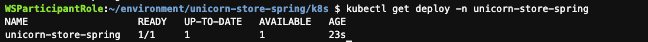
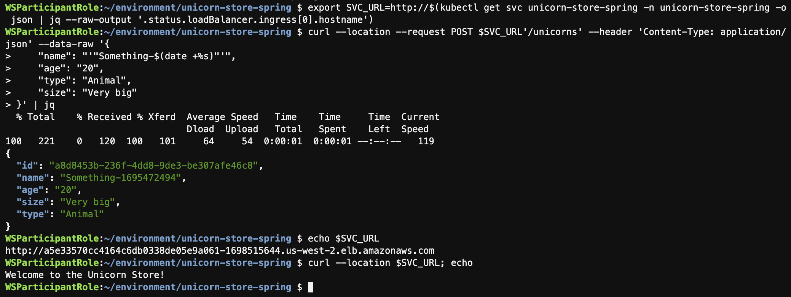
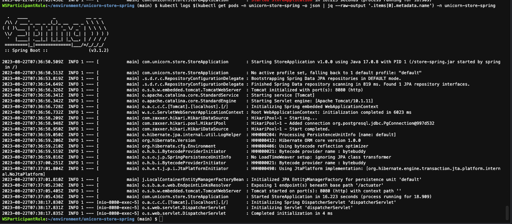

## Objective

This lab shows you how to deploy the the [Java Application](java/introduction/workshop-setup.md) project onto your Amazon EKS cluster.

## Prerequisites

- [Setup Amazon EKS for Java Application](./eks-setup.md)

## 1. Deploying the application

Create a new directory k8s in the application folder:

```bash showLineNumbers
mkdir ~/environment/unicorn-store-spring/k8s
cd ~/environment/unicorn-store-spring/k8s
```

Create Kubernetes manifest files for the deployment and the service:

```yml showLineNumbers
export ECR_URI=$(aws ecr describe-repositories --repository-names unicorn-store-spring \
  | jq --raw-output '.repositories[0].repositoryUri')
export SPRING_DATASOURCE_URL=$(aws ssm get-parameter --name databaseJDBCConnectionString \
  | jq --raw-output '.Parameter.Value')

cat <<EOF > ~/environment/unicorn-store-spring/k8s/deployment.yaml
apiVersion: apps/v1
kind: Deployment
metadata:
  name: unicorn-store-spring
  namespace: unicorn-store-spring
  labels:
    app: unicorn-store-spring
spec:
  replicas: 1
  selector:
    matchLabels:
      app: unicorn-store-spring
  template:
    metadata:
      labels:
        app: unicorn-store-spring
    spec:
      serviceAccountName: unicorn-store-spring
      containers:
        - name: unicorn-store-spring
          resources:
            requests:
              cpu: "1"
              memory: "2Gi"
            limits:
              cpu: "1"
              memory: "2Gi"
          image: ${ECR_URI}:latest
          env:
            - name: SPRING_DATASOURCE_PASSWORD
              valueFrom:
                secretKeyRef:
                  name: "unicornstore-db-secret"
                  key: "password"
                  optional: false
            - name: SPRING_DATASOURCE_URL
              value: ${SPRING_DATASOURCE_URL}
          ports:
            - containerPort: 8080
          livenessProbe:
            httpGet:
              path: /actuator/health/liveness
              port: 8080
          readinessProbe:
            httpGet:
              path: /actuator/health/readiness
              port: 8080
          lifecycle:
            preStop:
              exec:
                command: ["sh", "-c", "sleep 10"]
          securityContext:
            runAsNonRoot: true
            allowPrivilegeEscalation: false
EOF

cat <<EOF > ~/environment/unicorn-store-spring/k8s/service.yaml
apiVersion: v1
kind: Service
metadata:
  name: unicorn-store-spring
  namespace: unicorn-store-spring
  labels:
    app: unicorn-store-spring
spec:
  type: LoadBalancer
  ports:
    - port: 80
      targetPort: 8080
      protocol: TCP
  selector:
    app: unicorn-store-spring
EOF
```

Deploy manifests to EKS cluster:

```bash showLineNumbers
kubectl apply -f ~/environment/unicorn-store-spring/k8s/deployment.yaml
kubectl apply -f ~/environment/unicorn-store-spring/k8s/service.yaml
```

Verify that the application is running:

```bash showLineNumbers
kubectl wait deployment -n unicorn-store-spring unicorn-store-spring --for condition=Available=True --timeout=120s
kubectl get deploy -n unicorn-store-spring
export SVC_URL=http://$(kubectl get svc unicorn-store-spring -n unicorn-store-spring -o json | jq --raw-output '.status.loadBalancer.ingress[0].hostname')
while [[ $(curl -s -o /dev/null -w "%{http_code}" $SVC_URL/) != "200" ]]; do echo "Service not yet available ..." &&  sleep 5; done
echo $SVC_URL
echo Service is Ready!
```

:::info
The creation of the load balancer for the service might take around 2-5 minutes.
:::



Get the Load Balancer URL for the services and make an example API call:

```bash showLineNumbers
echo $SVC_URL
curl --location $SVC_URL; echo
curl --location --request POST $SVC_URL'/unicorns' --header 'Content-Type: application/json' --data-raw '{
    "name": "'"Something-$(date +%s)"'",
    "age": "20",
    "type": "Animal",
    "size": "Very big"
}' | jq
```



## 2. Exploring Amazon EKS in AWS console

Go to the [Amazon EKS](https://console.aws.amazon.com/eks/home#/) console directly, or navigate to Amazon EKS in the AWS console.

## 3. Accessing the application logs

To further inspect the application startup or runtime behavior you can navigate to the application logs with the following steps.

Get the logs from the current running pod via kubectl:

```bash showLineNumbers
kubectl logs $(kubectl get pods -n unicorn-store-spring -o json | jq --raw-output '.items[0].metadata.name') -n unicorn-store-spring
```

You should see a similar result to:



## Conclusion

In this section you have learned how to create a new EKS cluster. You deployed externals secrets, permissions and the UnicornStore Java application. With the container image deployed to Amazon EKS can now can apply different [Optimizations](java/optimizations/index.md) technics to container images.
