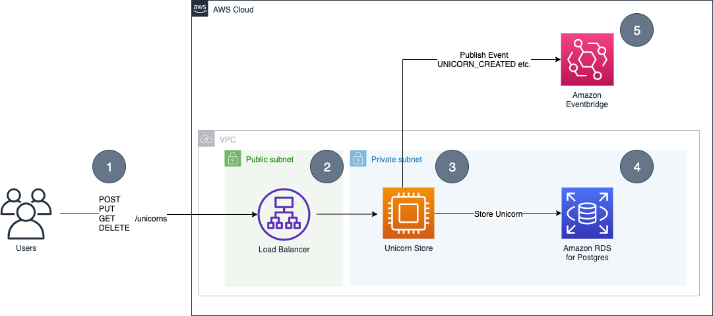
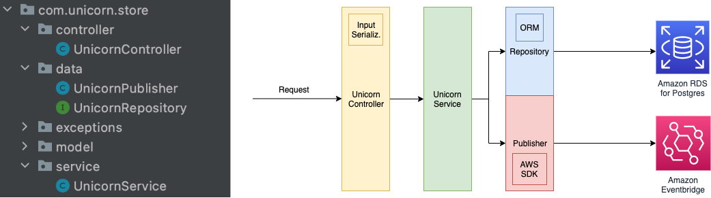

## Objective

Throughout the entire workshop we will be use the following reference application called the **UnicornStore**. In this section you will get an overview about the inner workings of the app.

## 1. Introducing the UnicornStore

The UnicornStore is a **[Spring Boot 3](https://spring.io/projects/spring-boot) Java Application** that provides Create-, Read-, Update-, and Delete-(CRUD)-Operations for Unicorn-Records.
It stores them in a relational database running on [Amazon RDS PostgreSQL](https://aws.amazon.com/rds/postgresql) and afterwards publishes an event about this action to [Amazon EventBridge](https://aws.amazon.com/eventbridge).

In a traditional **non-Serverless** and **non-Containers** setup the application could have been hosted like this:



- (1) End-user can interact with the service via a REST-API that provides basic CRUD operations

    - **POST `/unicorns`**          - Create a new unicorn
    - **PUT `/unicorns/{id}`**      - Update an existing unicorn
    - **GET `/unicorns/{id}`**      - Retrieve an existing unicorn
    - **DELETE `/unicorns/{id}`**   - Delete an existing unicorn

- (2) Usually a load balancer / reverse proxy acts as an entry point to the system and provides basic features such as TLS-termination and load distribution.

- (3) The application itself is not directly exposed to the internet and can be any kind of compute (EC2-Instance / VM / On-Prem server).

- (4) The application communicates with the database to store the Unicorn-Records. Depending on the service, this can be in the same subnet & VPC or in different ones.

- (5) Finally the application publishes an event about the action e.g. `UNICORN_CREATED`.

## 2. Inside the Java Code

:::info
You can also inspect the code directly in Cloud 9 in the /unicorn-store-spring/src folder.
:::

The example application in this workshop tries to find a balance between simplicity and comparability to a real world example.
The application therefore includes basic features such as Input-Serialization, Exception-Handling, Object-Relational-Mapping
and the usage of an additional SDK. The following diagram provides an overview of the classes and features used inside
the UnicornStore:



To get a better understanding how the components work together you will now walk through an example where a user requests to create a Unicorn (POST Request):

The **UnicornController** accepts the requests and directly provides it as a unicorn object (Input Serialization).
It has the additional responsibility to catch the exceptions that might happen in the further processing to provide a
meaningful message and HTTP-Code to the end user (Exception-Handling). Upon successful processing the controller returns
the result object and the proper HTTP-Code via a `ResponseEntity`.

```java showLineNumbers
@PostMapping("/unicorns")
public ResponseEntity<Unicorn> createUnicorn(@RequestBody Unicorn unicorn) {
    try {
        var savedUnicorn = unicornService.createUnicorn(unicorn);
        return ResponseEntity.ok(savedUnicorn);
    } catch (Exception e) {
        logger.error("Error creating unicorn", e);
        throw new ResponseStatusException(INTERNAL_SERVER_ERROR, "Error creating unicorn", e);
    }
}
```

The **UnicornService** passes it to the **UnicornRepository** which
is a default implementation of the `CRUDRepository` provided by [Spring Data](https://spring.io/projects/spring-data)
and afterwards calls the **UnicornPublisher** to publish an event.

```java showLineNumbers
public Unicorn createUnicorn(Unicorn unicorn) {
    var savedUnicorn = unicornRepository.save(unicorn);
    unicornPublisher.publish(savedUnicorn, UnicornEventType.UNICORN_CREATED);
    return savedUnicorn;
}
```

**UnicornRepository**:

```java showLineNumbers
@Repository
public interface UnicornRepository extends CrudRepository<Unicorn, String > {
}
```

The **UnicornPublisher** serializes the object and uses the AWS SDK to publish an event to Amazon EventBridge:

```java showLineNumbers
public void publish(Unicorn unicorn, UnicornEventType unicornEventType) {
    try {
        var unicornJson = objectMapper.writeValueAsString(unicorn);
        logger.info("Publishing ... " +  unicornEventType.toString());
        logger.info(unicornJson);

        var eventsRequest = createEventRequestEntry(unicornEventType, unicornJson);
        eventBridgeClient.putEvents(eventsRequest).get();
    } catch (JsonProcessingException e) {
        logger.error("Error JsonProcessingException ...");
        logger.error(e.getMessage());
    } catch (EventBridgeException | ExecutionException | InterruptedException e) {
        logger.error("Error EventBridgeException | ExecutionException ...");
        logger.error(e.getMessage());
    }
}
```

## Conclusion

In this section you got an overview about the Java Application which will be used during the workshop. You can now proceed with [Building and Running Container Images with Java Application Using Docker](java/containers/build-image.md).
