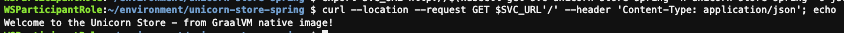
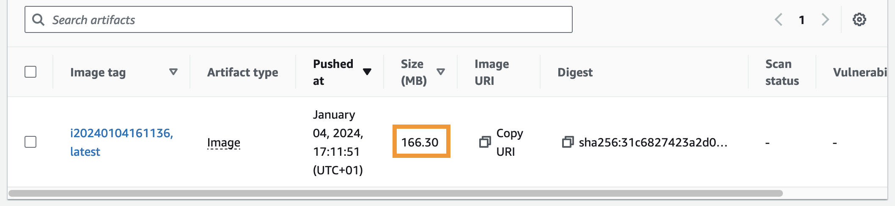
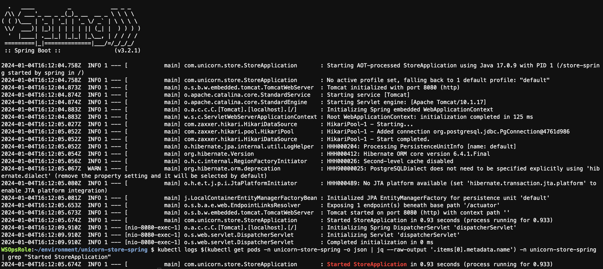

## Objective

In this lab we will build GraalVM native image.

## Prerequisites

- [Preparation](./baseline.md)

## Context

[GraalVM](https://www.graalvm.org/) is a high-performance runtime that is designed to address the limitations of traditional VMs such as initialization overhead and memory consumption.

Beyond using GraalVM as just another JVM, you can also create a native executable via the [native-image](https://www.graalvm.org/latest/reference-manual/native-image/) capability. This executable already includes all necessary dependencies (e.g. Garbage collector) and therefore does not a require a JVM to run your code.

One of the major advantages of `native-image` is that it produces a very low memory footprint native binary of applications. It does this by statically analyzing the code base and creating its own model of what is and what is not required at runtime. Anything which isn’t required is not included in the final native binary. This isn’t just whole classes, it can be individual methods and/or constructors.

This is great until the application includes dependencies which use features like reflection. The dynamic loading at runtime means that `native-image` has no way of knowing what classes may be required.

:::info
Remember `native-image` only has partial support for reflection and needs to know the reflectively accessed program elements ahead-of-time.
:::

In order to compile our application with `native-image`, we need to adapt our Dockerfile. In the previous version, `maven:3-amazoncorretto-17` was used as a builder-image for the application. Now, we will use the latest version of `ghcr.io/graalvm/graalvm-community`. The only additional software package needed for the build is Maven, which we install via [sdkman](https://sdkman.io/).

## Overview of components

To add GraalVM support to your existing project you'll need to execute the following steps:

- Adapt your **pom.xml** and add a native Maven build step
- Create a **Dockerfile** that includes all the necessary dependencies to build the application

For our application, we use Spring Boot version 3. A typical Spring Boot application is very dynamic, especially when it comes to automatic configuration. However, GraalVM assumes a closed-world scenario, which excludes dynamic aspects such as the generation of bytecode at runtime.

1. The Dockerfile contains all the necessary steps & GraalVM dependencies to build the application.
2. The native executable will be copied from the builder image to the runtime image.
3. The runtime image invokes the native binary with all necessary parameters.

:::info
You may also need to create additional files under `resources/META-INF/native-image` depending on the usage of reflection, dynamic proxies or JNI. To learn more, see [Native Image Compatibility Guide](https://www.graalvm.org/latest/reference-manual/native-image/metadata/Compatibility/). For this workshop, we have already prepared the files.
:::

## Assisted configuration with the Tracing Agent

As mentioned previously, `native-image` statically analyses the code base to determine which parts of the code are reachable at runtime. Unfortunately, this doesn't work in all cases. Dynamic features like reflection or proxies must be specified to `native-image` as metadata. To make this step as easy as possible, GraalVM provides a tracing agent to collect all necessary information and prepare configuration files. To learn more about how to use the tracing agent, see [Collect Metadata with the Tracing Agent](https://www.graalvm.org/latest/reference-manual/native-image/metadata/AutomaticMetadataCollection/). For this workshop, we have already prepared all necessary configuration files.

## Spring Boot and GraalVM

Traditionally, Spring Boot applications are very dynamic, especially at the start of an application, since a lot is configured at this point depending on the runtime environment. For this reason, the following restrictions are defined:

1. The classpath does not change after the build.
2. The beans that are defined in the application no longer change at runtime.

In order to build out UnicornStore-app using `native-image`, we need to to use the `spring-boot-starter-parent` and `native-maven-plugin` in our `pom.xml`-file.

```xml showLineNumbers
<parent>
    <groupId>org.springframework.boot</groupId>
    <artifactId>spring-boot-starter-parent</artifactId>
    ...
</parent>
```

```xml showLineNumbers
<plugin>
  <groupId>org.graalvm.buildtools</groupId>
  <artifactId>native-maven-plugin</artifactId>
  ...
</plugin>
```

:::info
In this lab, we used the Graal compiler option `-Ob` to enable quick build mode, which improves the performance of the compilation stage. Usually, this is used during development. To learn more, see [Native Image Build Output](https://www.graalvm.org/latest/reference-manual/native-image/overview/BuildOutput/).
:::

## 1. Preparing components

In the `pom.xml` file, we have included two different Maven-profiles which cover a JVM-, and GraalVM-build.

In the following section, you can see the modified Dockerfile.

```dockerfile showLineNumbers
# graalvm-ce is used as build-image
FROM ghcr.io/graalvm/graalvm-community:17 AS build-aot

RUN microdnf install -y unzip zip

RUN \
    curl -s "https://get.sdkman.io" | bash; \
    bash -c "source $HOME/.sdkman/bin/sdkman-init.sh; \
    sdk install maven;"

COPY ./pom.xml ./pom.xml
COPY src ./src/

ENV MAVEN_OPTS='-Xmx8g'

RUN bash -c "source $HOME/.sdkman/bin/sdkman-init.sh && mvn -Dmaven.test.skip=true clean package -Pnative"

FROM public.ecr.aws/amazonlinux/amazonlinux:2023.2.20231026.0
RUN yum install -y shadow-utils

RUN groupadd --system spring -g 1000
RUN adduser spring -u 1000 -g 1000

COPY --from=build-aot /app/target/store-spring /

USER 1000:1000

EXPOSE 8080

CMD ["./store-spring", "-Dserver.port=8080"]
```

We have made several changes to the Dockerfile. First, we switched to using `ghcr.io/graalvm/graalvm-community` as the parent image for the build process. This image includes all the necessary software components for the build, with the exception of Maven. Building a native image requires a significant amount of memory, so we set the maximum available memory to 8 GB. To build a native image, it is required to specify `-Pnative` as an additional parameter in the Maven build.

In the target image, the native binary is first copied from the build image. Then the necessary environment variables are set for OTEL, and in the last step, the GraalVM version of the unicorn app is started.

Copy the Dockerfile:

```bash showLineNumbers
cd ~/environment/unicorn-store-spring
cp dockerfiles/Dockerfile_05_GraalVM Dockerfile
```

Change the contents of the getWelcomeMessage function to identify the new version of the application:

```java showLineNumbers {3}
@GetMapping("/")
public ResponseEntity<String> getWelcomeMessage() {
    return new ResponseEntity<>("Welcome to the Unicorn Store - from GraalVM native image!", HttpStatus.OK);
}
```

:::info
AWS Cloud9 does not auto-save your files. Please ensure to save your files before deploying any changes via Ctrl+S or the top menu File&rarr;Save all.
:::

Reboot the Cloud9 instance to free-up memory. The instance should be back online in about one minute.

```bash showLineNumbers
sudo reboot now
```

Build locally on Cloud9:

```bash showLineNumbers
cd ~/environment/unicorn-store-spring
docker buildx build --load -t unicorn-store-spring:latest .
```

Push the new application image:

```bash showLineNumbers
cd ~/environment/unicorn-store-spring
export ECR_URI=$(aws ecr describe-repositories --repository-names unicorn-store-spring | jq --raw-output '.repositories[0].repositoryUri')
aws ecr get-login-password --region $AWS_REGION | docker login --username AWS --password-stdin $ECR_URI

IMAGE_TAG=i$(date +%Y%m%d%H%M%S)
docker tag unicorn-store-spring:latest $ECR_URI:$IMAGE_TAG
docker tag unicorn-store-spring:latest $ECR_URI:latest
docker push $ECR_URI:$IMAGE_TAG
docker push $ECR_URI:latest
```

## 2. Re-deploying the application

After the new image has been pushed to ECR you can re-trigger the deployment of the application:

```bash showLineNumbers
kubectl rollout restart deploy unicorn-store-spring -n unicorn-store-spring
kubectl rollout status deployment unicorn-store-spring -n unicorn-store-spring
```

## 3. Testing the application

Run the following API call to verify that the new version of the application was successfully deployed:

Export the Service URL for later use:

```bash showLineNumbers
export SVC_URL=http://$(kubectl get svc unicorn-store-spring -n unicorn-store-spring -o json | jq --raw-output '.status.loadBalancer.ingress[0].hostname')
curl --location --request GET $SVC_URL'/' --header 'Content-Type: application/json'; echo
```



## 4. Retrieving the results

Verify the new application image size in the [Amazon ECR](https://console.aws.amazon.com/ecr/home#/) console:



Retrieve the logs for the application as outlined in the previous section. Below you can find an example starting time after the optimization of the Amazon EKS deployment:

```bash showLineNumbers
kubectl logs $(kubectl get pods -n unicorn-store-spring -o json | jq --raw-output '.items[0].metadata.name') -n unicorn-store-spring
kubectl logs $(kubectl get pods -n unicorn-store-spring -o json | jq --raw-output '.items[0].metadata.name') -n unicorn-store-spring | grep "Started StoreApplication"
```



## Conclusion

As you can see from the previous initialization and execution duration, the performance drastically improved, from more than 12 seconds to less than a second using the GraalVM native image, compared to the initial image. The result is a 93% reduction in image size.
