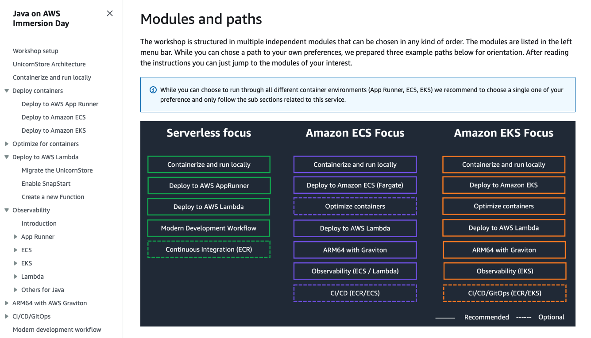

During this workshop, you've learned how to create container images using the Spring Boot Java Application. You've also explored various optimization techniques for these container images and successfully deployed them, along with your Java Application, to an Amazon EKS cluster.

If you want to learn more about Cloud-native Java development on AWS you could dive deeper and explore [Java on AWS Immersion Day](https://catalog.workshops.aws/java-on-aws).

https://catalog.workshops.aws/java-on-aws

Happy building!
