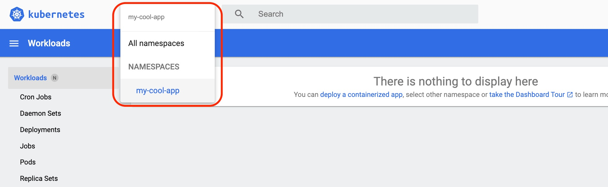
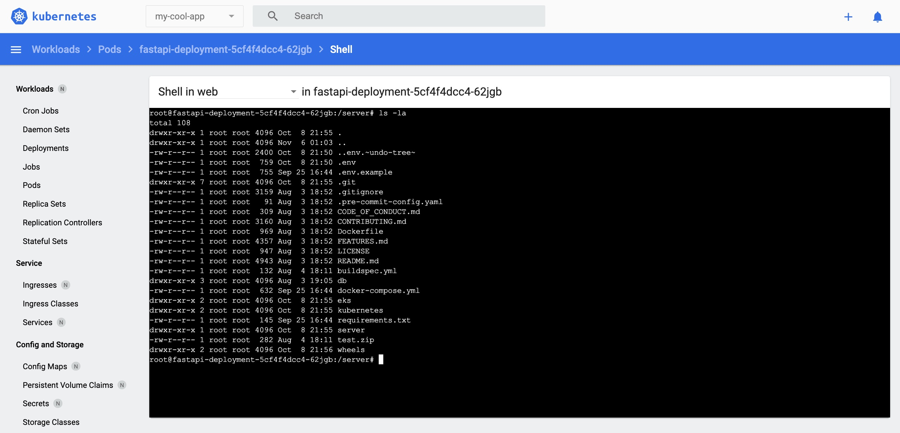
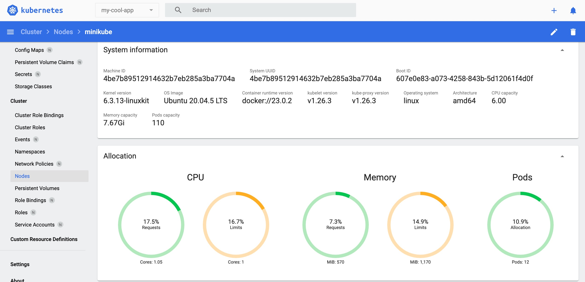

## Objective

This lab walks you through the process of using the [Kubernetes Dashboard](https://github.com/kubernetes/dashboard) to view and manage Kubernetes resources. This user-friendly web-based GUI facilitates the management and troubleshooting of applications within your minikube cluster.

## Prerequisites

- [Accessing the FastAPI App](./access-app.md)

## 1. Installing the Kubernetes Dashboard

To install and initiate the Kubernetes Dashboard, open your terminal and run the command outlined in the [Minikube documentation](https://minikube.sigs.k8s.io/docs/handbook/dashboard/). Once started, the Dashboard should automatically open in your default web browser. If it doesn't open automatically, the terminal will display a URL as part of the command's output that you can copy and paste into your web browser to access the Dashboard manually.

```bash
minikube dashboard
```

To monitor CPU and memory usage statistics of the pods via the Kubernetes Dashboard, the 'metrics-server' needs to be active. Install it using the following command:

```bash
minikube addons enable metrics-server
```

## 2. Viewing Kubernetes resources

### Filter Kubernetes resources by the Namespace my-cool-app

This workshop uses the 'my-cool-app' namespace. While the option to view "All namespaces" exists, narrowing down to specific resources streamlines the process. To filter, type the following:



Subsequently, navigate to 'Workloads' to list relevant resources. With 'metrics-server' enabled, you can also view CPU and memory statistics here.


Then, press the Pod 'fastapi-deployment' link circled in red.

### View the details of the Pod 'fastapi-deployment'

Click on the 'fastapi-deployment' pod to check the spec and status.


Click the first button from the left of the red frame to check the Pod's container log. You can use this functionality in lieu of the 'kubectl logs' command when using the Kubernetes Dashboard.


Press the second button from the left of the red frame to log in to the Pod using a shell. You can use this functionality in lieu of the 'kubectl exec' command when using the Kubernetes Dashboard.



### View the details of the Service 'fastapi-service'

Switching to 'Services' in the navigation pane presents a list of created services.


Press the Service 'fastapi-service' link circled in red to check the spec and status of the Service 'fastapi-service', or check the endpoint pod list to see which requests have been routed.


### View the details of the Node 'minikube'

Exploring 'Nodes' shows the available nodes that have been created. In Minikube's case, typically you'll see the 'minikube' node, because it's a cluster that has only one node.


Click the Node 'minikube' link circled in red. Here, you can check the node's spec, status, and usage status.



## Conclusion

This lab has provided how to review deployed Kubernetes resources using the Kubernetes Dashboard. You are able to manage and troubleshoot Kubernetes resources with a GUI by using the Kubernetes Dashboard instead of using kubectl commands. By using it, it will be easier to manage workloads in actual production environments.
