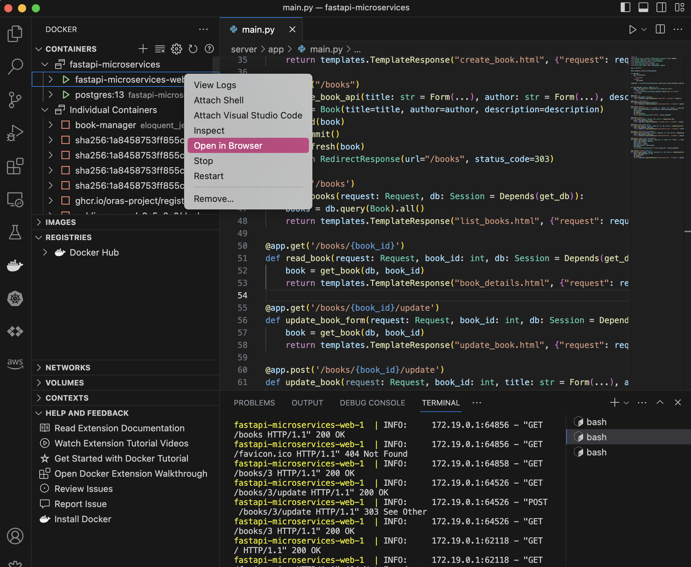

import Tabs from '@theme/Tabs';
import TabItem from '@theme/TabItem';
import GetEnvVars from '../../../src/includes/get-env-vars.md';

## Objective

This lab walks you through the process of building container images for our [python-fastapi-demo-docker](https://github.com/aws-samples/python-fastapi-demo-docker) project and running them as distinct services using Docker Compose and providing the Finch equivalent commands. By the end, you'll know how to manage your multi-service applications more effectively, ensuring smoother development, deployment, and updates.

## Prerequisites

- [Setting up the Development Environment](../../python/introduction/environment-setup.md)

<!--This is a shared file at src/includes/get-env-vars.md that tells users to navigate to the 'python-fastapi-demo-docker' directory where their environment variables are sourced.-->
<GetEnvVars />

## 1. Building Docker Images for Each Service

Build Docker images for the application and database services by running:

```bash
docker-compose build
```

Alternatively, if you're using Finch, run the following command to build the container images for the application and database:

```bash
finch compose build --platform linux/amd64
```

This builds Docker images based on the configurations in the docker-compose.yml file. Docker follows the Dockerfile instructions during each service's build process, creating separate images for the 'python-fastapi-demo-docker-web' and 'python-fastapi-demo-docker-db' services.

## 2. Running the Services as Docker Containers

After building the images, start the application and database services in separate Docker containers using:

```bash
docker-compose up
```

Alternatively, if you're using Finch, run the following command to start the application and database services:

```bash
finch compose up
```

This command initiates containers for each service as specified in the docker-compose.yml file. 

**Use the tabs below to see the steps for the specific environment where you are running this lab.**

<Tabs>

  <TabItem value="AWS Workshop Studio" label="AWS Workshop Studio" default>

Find the public IP of the EC2 instance where you are running this lab using the command below

Example:
```
echo $PUBLIC_IP
1.2.3.4
```
Then use the public IP of the EC2 instance and port 8000 to connect to the FastAPI application in your web browser.

Example: http://1.2.3.4:8000

</TabItem>

  <TabItem value="Local Computer" label="Local Computer" default>
Upon navigating to [http://localhost:8000](http://localhost:8000/) in your browser, you should see the FastAPI application running.

</TabItem>
</Tabs>


## 3. Verify the Setup by Adding a Book

To confirm that everything is functioning as expected, attempt to add a book by selecting the **Create a book** option.


## 4. Interpreting Containers

Your application ('python-fastapi-demo-docker-web' service) and your database ('python-fastapi-demo-docker-db' service) will operate in separate containers. The "Containers" tab in the [Docker VS Code Extension](https://code.visualstudio.com/docs/containers/overview) shows the containers for our python-fastapi-demo-docker application, as instances of the services in our Docker Compose configuration.



## 5. Stopping the Services and Their Containers

Stop and remove the containers of both services by pressing `CTRL + C` or running the following command:

```bash
docker-compose down
```

Alternatively, if you're using Finch, press CTRL + C or run the following command to stop and remove the containers:

```bash
finch compose down
```

This command halts the containers and, by default, also removes the containers, networks, and volumes as described in your docker-compose.yml file.

## 6. Rebuilding and Restarting Docker Services

To rebuild the images and restart the services simultaneously, execute the following command:

```bash
docker-compose up --build
```

Alternatively, if you're using Finch, run the following command:

```bash
finch compose up --build
```

This halts your services, rebuilds the Docker images, and reboots the services with the new images, ensuring your services are always operating with the latest application version.

## Conclusion

This lab explored the process of constructing and executing Docker containers using Docker Compose in the 'python-fastapi-demo-docker' project. This approach provides an efficient way to manage multi-service applications, which greatly benefits developers by streamlining the process.
