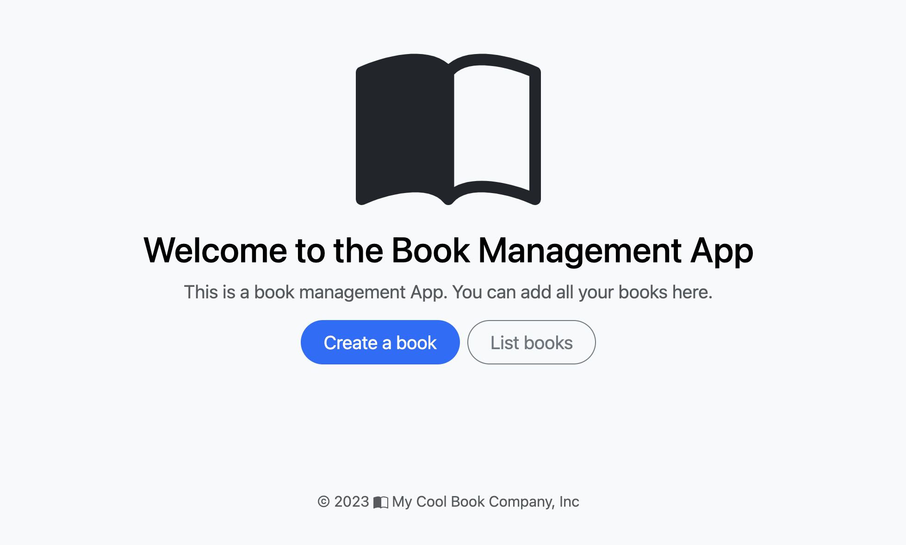
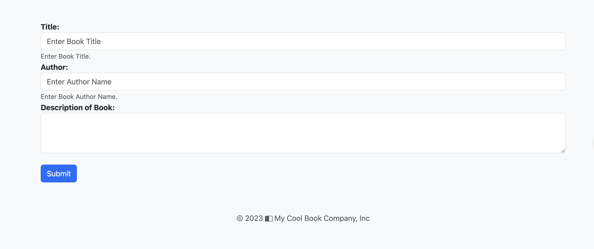

import GetEnvVars from '../../../src/includes/get-env-vars.md';

## Objective

This guide aims to guide you through the process of accessing your microservices deployed onto EKS cluster. By using ingress object we were able to expose FastAPI service through Application Loadbalancer. The management of the Application Load Balancer through ingress manifest is handled differently depending on your cluster configuration: for EKS Auto Mode clusters, the ALB is managed by EKS Auto Mode, while for clusters using Managed node groups, the ALB is managed by the AWS Load Balancer Controller.

## Prerequisites

- [Deploying FastAPI and PostgreSQL Microservices to EKS](./deploy-app.md)

<!--This is a shared file at src/includes/get-env-vars.md that tells users to navigate to the `python-fastapi-demo-docker` directory where their environment variables are sourced.-->
<GetEnvVars />

## 1. Checking the Status of Pods

Before we try to access our application, we need to ensure that all of our pods are running correctly. To check the status of all pods, run the following command:

```bash
kubectl get pods -n my-cool-app
```

The expected output should look like this:

``` bash
NAME                                 READY   STATUS    RESTARTS   AGE
fastapi-deployment-9776bd4c7-t8xkm   1/1     Running   0          99s
fastapi-postgres-0                   1/1     Running   0          8m28s
```

All your pods should be in the "Running" state. If they're not, you will need to troubleshoot the deployment before proceeding.

## 2. Getting the ALB URL

Run the following command to get the ALB URL:

```bash
kubectl get ingress -n my-cool-app
```

The expected output should look like this:

```bash
NAME              CLASS    HOSTS   ADDRESS                                                                  PORTS   AGE
fastapi-ingress   <none>   *       k8s-mycoolap-fastapii-8114c40e9c-860636650.us-west-2.elb.amazonaws.com   80      3m17s
```

## 3. Accessing the FastAPI Service

In the previous lab exercise, we used EKS Auto Mode or AWS Load Balancer Controller (LBC) to dynamically provision an [Application Load Balancer (ALB)](https://docs.aws.amazon.com/elasticloadbalancing/latest/application/introduction.html). Note that it takes several minutes or more before the ALB has finished provisioning.

1. **Check the status**: Open the [Load Balancers](https://console.aws.amazon.com/ec2/#LoadBalancers:) page on the Amazon EC2 console and select the AWS Region in which your Amazon EKS cluster resides. Next, select your ALB name, such as `k8s-mycoolap-fastapii-8004c40e9c`.
2. **Open the app**: Open a new tab in your browser paste the ALB link, such as `k8s-mycoolap-fastapii-8114c40e9c-860636650.us-west-2.elb.amazonaws.com`. You should see the welcome page:



## 4. Verifying the Setup by Adding a Book

To confirm that everything is functioning as expected, attempt to add a book by selecting the **Create a book** option.



## Conclusion

This guide has walked you through the steps necessary to access the FastAPI service deployed on an EKS cluster. We've shown you how to check the status of your pods and verify your setup by interacting with the FastAPI service.
