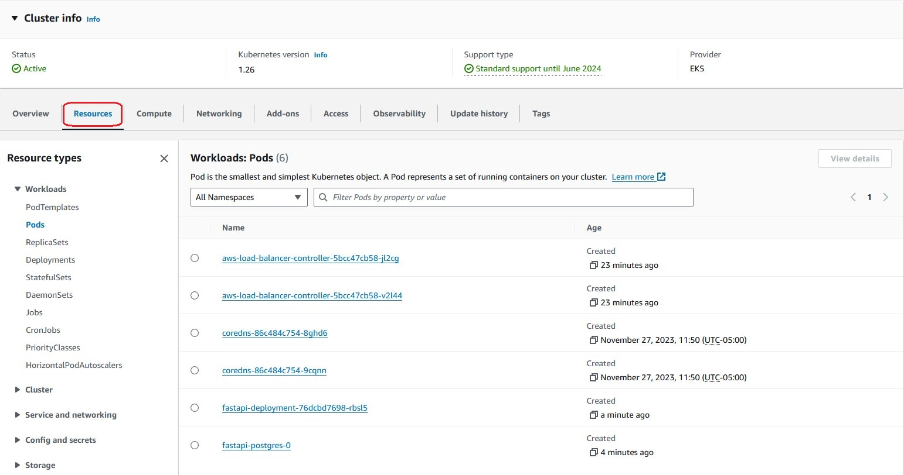
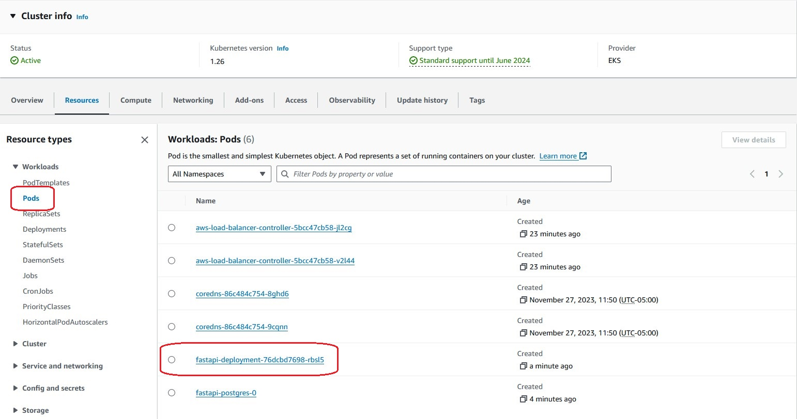
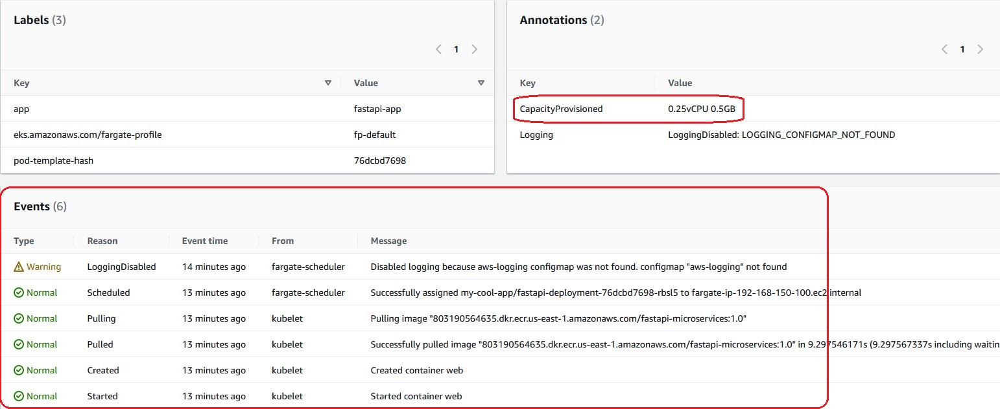
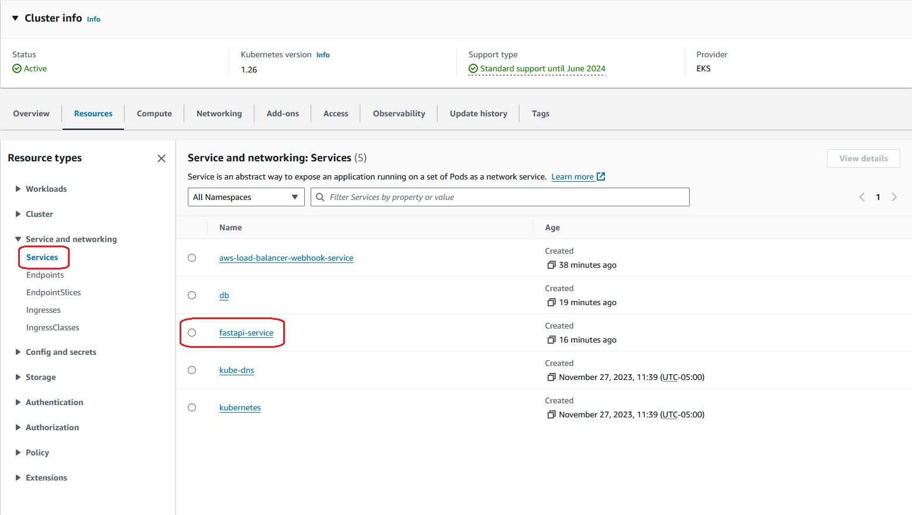
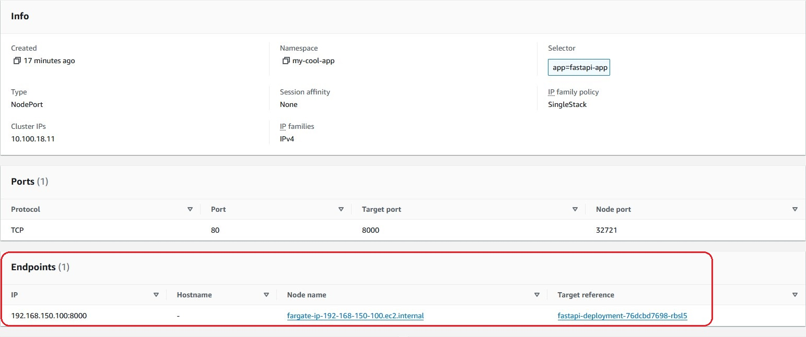

import Tabs from '@theme/Tabs';
import TabItem from '@theme/TabItem';

## Objective

This lab shows you how to view Kubernetes resources such as Pods, Services, and Nodes using the EKS console. With EKS, there is no need to deploy and manage a Kubernetes Dashboard Pod in order to view Kubernetes resources. To use this EKS console feature, the IAM principal logged into the EKS console must have the required permissions to access the EKS cluster. 

Of course, it's also possible to use the Kubernetes Dashboard instead of the EKS console. If you use Kubernetes Dashboard, please check the [kubernetes/dashboard: General-purpose web UI for Kubernetes clusters](https://github.com/kubernetes/dashboard) in the GitHub for installation instructions. You can also refer to [Monitoring Kubernetes Resources Using the Dashboard](http://localhost:3000/docs/python/kubernetes/kubernetes-dashboard) page for operation methods.

## Prerequisites

- [Accessing the FastAPI App](./access-app.md)

## 1. Checking IAM permissions for the IAM principal logging into the EKS console

**Use the tabs below to see the steps for the specific environment where you are running this lab.**

<Tabs>
  <TabItem value="AWS Workshop Studio" label="AWS Workshop Studio" default>

You can access the EKS Console from the AWS Workshop Studio event page, as explained in section [Setting up the Development Environment](./../introduction/environment-setup.md). 

The IAM role used in Workshop Studio is the same IAM role that you have been using in Visual Studio to run CLI commands. This role is the creator of the cluster and it already has all required permissions.

Next, skip to step '[4. View Kubernetes resources](#4-viewing-your-kubernetes-resources)' 

</TabItem>
  <TabItem value="Local Computer" label="Local Computer" default>

Make sure that the IAM principal you are using to log into the EKS console has the required permissions according to [View Kubernetes resources](https://docs.aws.amazon.com/eks/latest/userguide/view-kubernetes-resources.html#view-kubernetes-resources-permissions) in EKS documentation. If any permissions are missing, add them. Once the necessary permissions have been added, proceed to the next step.


</TabItem>


</Tabs>

## 2. Creating Kubernetes RBAC resources


:::caution

If the IAM principal logged into the EKS console is the creator of the EKS cluster, skip this step and proceed to step '[4. View Kubernetes resources](#4-viewing-your-kubernetes-resources)'. This is because this IAM principal already has the necessary RBAC permissions.

:::


To view Kubernetes resources for all namespaces, create RBAC resources by applying the following manifest:

```bash
kubectl apply -f https://s3.us-west-2.amazonaws.com/amazon-eks/docs/eks-console-full-access.yaml
```

The expected output should look like this:

```bash
clusterrole.rbac.authorization.k8s.io/eks-console-dashboard-full-access-clusterrole created
clusterrolebinding.rbac.authorization.k8s.io/eks-console-dashboard-full-access-binding created
```

You can also view Kubernetes resources limited to a specific namespace. Refer to the EKS documentation for more details on creating RBAC bindings for a namespace.

## 3. Creating the access entry for the IAM principal ARN


**Optionally**, you can create the access entry for an existing IAM principal ARN logged into the EKS console by running the following command. Make sure to substitute the sample value with your _existing_ IAM principal ARN as the value for the `--principal-arn` argument:

<Tabs>
  <TabItem value="EKS Auto Mode" label="EKS Auto Mode" default>


```
aws eks create-access-entry --cluster-name automode-quickstart  \
  --principal-arn arn:aws:iam::012345678901:role/my-console-viewer-role  \
  --kubernetes-groups eks-console-dashboard-full-access-group
```

The expected output should look like this:

```
{
    "accessEntry": {
        "clusterName": "automode-quickstart",
        "principalArn": "arn:aws:iam::012345678901:role/my-console-viewer-role",
        "kubernetesGroups": [
            "eks-console-dashboard-full-access-group"
        ],
        "accessEntryArn": "arn:aws:eks:us-east-1:012345678901:access-entry/automode-quickstart/role/092934755410/my-console-viewer-role/xxxxxxxx-xxxx-xxxx-xxxx-xxxxxxxxxxxx",
        "createdAt": "2025-06-18T21:36:50.926000-07:00",
        "modifiedAt": "2025-06-18T21:36:50.926000-07:00",
        "tags": {},
        "username": "arn:aws:sts::012345678901:assumed-role/my-console-viewer-role/{{SessionName}}",
        "type": "STANDARD"
    }
}
```

</TabItem>
  <TabItem value="Managed Node Groups" label="Managed Node Groups" default>


```
aws eks create-access-entry --cluster-name managednode-quickstart  \
  --principal-arn arn:aws:iam::012345678901:role/my-console-viewer-role  \
  --kubernetes-groups eks-console-dashboard-full-access-group
```

The expected output should look like this:

```
{
    "accessEntry": {
        "clusterName": "managednode-quickstart",
        "principalArn": "arn:aws:iam::012345678901:role/my-console-viewer-role",
        "kubernetesGroups": [
            "eks-console-dashboard-full-access-group"
        ],
        "accessEntryArn": "arn:aws:eks:us-east-1:012345678901:access-entry/automode-quickstart/role/092934755410/my-console-viewer-role/xxxxxxxx-xxxx-xxxx-xxxx-xxxxxxxxxxxx",
        "createdAt": "2025-06-18T21:36:50.926000-07:00",
        "modifiedAt": "2025-06-18T21:36:50.926000-07:00",
        "tags": {},
        "username": "arn:aws:sts::012345678901:assumed-role/my-console-viewer-role/{{SessionName}}",
        "type": "STANDARD"
    }
}
```

  </TabItem>
</Tabs>


## 4. Viewing your Kubernetes resources

You can check your Kubernetes resources on the 'Resources' tab on the cluster details page in the EKS console. 

Note: The following examples use a Fargate cluster.



### View the details of the Pod 'fastapi-deployment'

Select the 'Pods' in the 'Workloads' tree under the 'Resource Types', and click on the 'fastapi-deployment' Pod link in the red frame.



As a result, you can check the details of the Pod's resource information. You can troubleshoot by checking the Events log. Also, in the case of Fargate Pods, you can check the compute resources provisioned from the 'CapacityProvisioned' annotation. In this example, it's '0.25 vCPU 0.5 GB'.



### View the details of the Service 'fastapi-service'

Then, select the 'Services' in the 'Service and Networking' tree under the 'Resource Types' and click on the 'fastapi-service' service link in the red frame.



As a result, you can check the Service's resource details. You can check the Event logs and see the Pods to which requests are routed in the 'Endpoints', and you can navigate to those Pods from these links.


