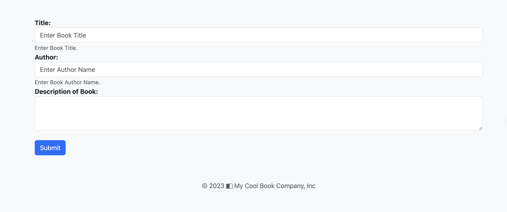

import Tabs from '@theme/Tabs';
import TabItem from '@theme/TabItem';
import GetEnvVars from '../../../src/includes/get-env-vars.md';

## Objective
This lab aims to guide you through the process of accessing your microservices deployed onto a minikube cluster. By using minikube's 'port forwarding' feature and enabling a network tunnel, we'll expose the FastAPI service, allowing you to interact with it from your local machine's web browser. This process is especially crucial for LoadBalancer service types, as they require an additional network route from the host to the service's cluster.

## Prerequisites
- [Deploying FastAPI and PostgreSQL Microservices to Kubernetes using Minikube](./deploy-app.md)

<!--This is a shared file at src/includes/get-env-vars.md that tells users to navigate to the 'python-fastapi-demo-docker' directory where their environment variables are sourced.-->
<GetEnvVars />


## 1. Checking the Status of Pods
Before we try to access our application, we need to ensure that all of our pods are running correctly. To check the status of all pods, run the following command:
```bash
kubectl get pods -n my-cool-app
```
All your pods should be in the "Running" state. If they're not, you will need to troubleshoot the deployment before proceeding.

## 2. Accessing the FastAPI Service

**Use the tabs below to see the steps for the specific environment where you are running this lab.**

<Tabs>

  <TabItem value="AWS Workshop Studio" label="AWS Workshop Studio" default>

Use the [minikube service](https://minikube.sigs.k8s.io/docs/commands/service/) command to create a tunnel to the cluster and connect to FastAPI service:
```bash
minikube service fastapi-service --namespace=my-cool-app
```
The expected output should look like this:
```bash
|-------------|-----------------|-------------|---------------------------|
|  NAMESPACE  |      NAME       | TARGET PORT |            URL            |
|-------------|-----------------|-------------|---------------------------|
| my-cool-app | fastapi-service |          80 | http://192.168.49.2:30639 |
|-------------|-----------------|-------------|---------------------------|
🎉  Opening service my-cool-app/fastapi-service in default browser...
👉  http://192.168.49.2:30639
```
Minikube exposes service port 80 using localhost address. Additionally, you need to expose the service on the EC2 instance public IP address, to be able to access it from your local browser.

Expose the service port 80 using host port 8000 by running
```bash
kubectl -n my-cool-app port-forward --address 0.0.0.0 service/fastapi-service 8000:80
```
Keep this command running while accessing the service with the steps below.

Find the public IP of the EC2 instance where you are running this lab using the command below

Example:
```
echo $PUBLIC_IP
1.2.3.4
```
Then use the public IP of the EC2 instance and port 8000 to connect to Node Port service fastapi-service in your web browser.

Example: http://1.2.3.4:8000

</TabItem>

  <TabItem value="Local Computer" label="Local Computer" default>

Use the [minikube service](https://minikube.sigs.k8s.io/docs/commands/service/) command to create a tunnel to the cluster and connect to FastAPI service:
```bash
minikube service fastapi-service --namespace=my-cool-app
```
The expected output should look like this:
```bash
|-------------|-----------------|-------------|---------------------------|
|  NAMESPACE  |      NAME       | TARGET PORT |            URL            |
|-------------|-----------------|-------------|---------------------------|
| my-cool-app | fastapi-service |          80 | http://192.168.49.2:30639 |
|-------------|-----------------|-------------|---------------------------|
🏃  Starting tunnel for service fastapi-service.
|-------------|-----------------|-------------|------------------------|
|  NAMESPACE  |      NAME       | TARGET PORT |          URL           |
|-------------|-----------------|-------------|------------------------|
| my-cool-app | fastapi-service |             | http://127.0.0.1:58665 |
|-------------|-----------------|-------------|------------------------|
🎉  Opening service my-cool-app/fastapi-service in default browser...
❗  Because you are using a Docker driver on darwin, the terminal needs to be open to run it.
```
This command needs to be continuously running to keep the network route open, so make sure to leave this terminal window open.

</TabItem>

</Tabs>

## 3. Verifying the Setup by Adding a Book
To confirm that everything is functioning as expected, attempt to add a book by selecting the **Create a book** option.



## Conclusion
This lab has walked you through the steps necessary to access your microservices, specifically the FastAPI service, deployed on a minikube cluster from your local machine. We've shown how to check the status of your pods, enable a minikube tunnel for access, and verify your setup by interacting with the FastAPI service. The minikube service command is a convenient way to expose your Kubernetes services to your local machine and interact with them as if they were locally deployed.