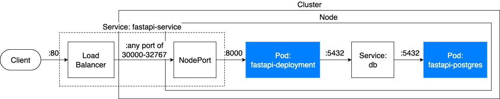

import GetEnvVars from '../../../src/includes/get-env-vars.md';
import GetECRURI from '../../../src/includes/get-ecr-uri.md';

## Objective

This lab is designed to equip you with the necessary skills for efficient deployment and management of microservices, specifically those belonging to the [python-fastapi-demo-docker](https://github.com/aws-samples/python-fastapi-demo-docker) project, within a Kubernetes environment. Through the steps outlined in this lab, you will learn how to configure, deploy, and manage your microservices using Minikube and Amazon ECR. For a comprehensive understanding of the different Kubernetes resources being created, refer to [Introduction to Managing Multiple Services with Kubernetes](about-multiservice.md).

## Prerequisites

- [Securing FastAPI Microservices with Kubernetes Secrets](./deploy-secrets.md)

<!--This is a shared file at src/includes/get-env-vars.md that tells users to navigate to the 'python-fastapi-demo-docker' directory where their environment variables are sourced.-->
<GetEnvVars />

## 1. Creating the PostgreSQL StatefulSet, Service, and PersistentVolumeClaim

The '[postgres-db.yaml](https://github.com/aws-samples/python-fastapi-demo-docker/blob/main/kubernetes/postgres-db.yaml)' manifest also consists of three primary Kubernetes resources: a StatefulSet, a Service, and a PersistentVolumeClaim.

:::tip

Take note that the Kubernetes service name of 'db' **must** match the server name 'db' in postgresql URL, which is set in file .env with variable `DOCKER_DATABASE_URL=postgresql://bookdbadmin:dbpassword@db:5432/bookstore`.

:::

From the 'python-fastapi-demo-docker' project directory, apply the Kubernetes configuration:

```bash
kubectl apply -f kubernetes/postgres-db.yaml
```

The expected output should look like this:

```bash
service/db created
statefulset.apps/fastapi-postgres created
persistentvolumeclaim/postgres-pvc created
```

## 2. Creating the FastAPI Deployment and Service

The '[fastapi-app.yaml](https://github.com/aws-samples/python-fastapi-demo-docker/blob/main/kubernetes/fastapi-app.yaml)' manifest consists of two primary Kubernetes resources: a Service and a Deployment.

<!--This is a shared file at src/includes/get-ecr-uri.md that shows users how to get their ECR URI.-->
<GetECRURI />

Next, open file **[kubernetes/fastapi-app.yaml](https://github.com/aws-samples/python-fastapi-demo-docker/blob/main/kubernetes/fastapi-app.yaml)** and replace the sample value for container image with your ECR repository URI image and tag (e.g., `1.0`).

The result should look like below:
```yaml
...
      containers:
      - name: web
        image: 01234567890.dkr.ecr.us-east-1.amazonaws.com/fastapi-microservices:1.0
...
```

From the 'python-fastapi-demo-docker' project directory, apply the Kubernetes configuration:

```bash
kubectl apply -f kubernetes/fastapi-app.yaml
```

The expected output should look like this:

```bash
service/fastapi-service created
deployment.apps/fastapi-deployment created
```

## 3. Verifying the Deployment
After applying the configuration, verify that the Deployment is running correctly.

[Minikube](https://minikube.sigs.k8s.io/docs/) is a simple lightweight cluster containing only 1 node. The Pods and Services deployed by the previous steps and the request flow are as follows.



First, check the Services:

```bash
kubectl get services -n my-cool-app
```

The expected output should look like this:

```bash
NAME              TYPE           CLUSTER-IP      EXTERNAL-IP   PORT(S)        AGE
db                ClusterIP      None            <none>        5432/TCP       101m
fastapi-service   LoadBalancer   10.108.241.54   <pending>     80:32180/TCP   95m
```

Because the Service type of fastapi-service is [LoadBalancer](https://kubernetes.io/docs/concepts/services-networking/service/#loadbalancer), Minikube provisions a load balancer for the Service. 

The port 80 in the PORT(S) column of fastapi-service is for LoadBalancer, and the port 32180 is for [NodePort](https://kubernetes.io/docs/concepts/services-networking/service/#type-nodeport). NodePort is the port that the node accepts requests from outside the Kubernetes cluster and routes them to Services. If the port number of NodePort isn't explicitly specified, one port in the range of 30000 to 32767 will be assigned as default behavior. In the case of this example, it was 32180. In your case the port number may be different.

Then, check the Deployment:

```bash
kubectl get deployments -n my-cool-app
```

The expected output should look like this:

```bash
NAME                 READY   UP-TO-DATE   AVAILABLE   AGE
fastapi-deployment   1/1     1            1           9m
```

A [Deployment](https://kubernetes.io/docs/concepts/workloads/controllers/deployment/) is Kubernetes Workload API object that provides declarative update functionalities for [ReplicaSets](https://kubernetes.io/docs/concepts/workloads/controllers/replicaset/) and Pods. Deployment's functionalities are provided by the [kube-controller-manager](https://kubernetes.io/docs/concepts/overview/components/#kube-controller-manager)'s Deployment controller. The Deployment controller creates ReplicaSet and  the kube-controller-manager's ReplicaSet controller creates Pods.

Check the ReplicaSet and Pod that created by kube-controller-manager:

``` bash
kubectl get rs,pod -n my-cool-app -l app=fastapi-app
```

The expected output should look like this:

```bash
NAME                                            DESIRED   CURRENT   READY   AGE
replicaset.apps/fastapi-deployment-5cf4f4dcc4   1         1         1       109m

NAME                                      READY   STATUS    RESTARTS   AGE
pod/fastapi-deployment-5cf4f4dcc4-62jgb   1/1     Running   0          100m
```

Then, check about Pod db. The pod uses StatefulSet. Run the following command:

```bash
kubectl get statefulsets -n my-cool-app
```

The expected output should look like this:

```bash
NAME               READY   AGE
fastapi-postgres   1/1     18m
```

A [StatefulSet](https://kubernetes.io/docs/concepts/workloads/controllers/statefulset/) is a Kubernetes Workload API object for managing stateful applications such as databases. The kube-controller-manager's StatefulSet controller creates Pods. Then, if a pod is replaced due to a failure, the StatefulSet controller will create new pod and the PersistentVolume used by the previous Pod can be attached to the new pod.
PersistentVolume is a persistent volume as the name suggests, and unlike ephemeral volumes such as those used as the root volume of a node, it is possible to leave it even when the node terminates. PersistentVolume is associated with Pods by PersistentVolumeClaims.

Check the PersistentVolumeClaim and the PersistentVolume:

```bash
kubectl get pvc,pv -n my-cool-app
```

The expected output should look like this:

```bash
NAME                                 STATUS   VOLUME                                     CAPACITY   ACCESS MODES   STORAGECLASS   AGE
persistentvolumeclaim/postgres-pvc   Bound    pvc-47edb62d-98b6-4973-9d81-337846a5f3cd   1Gi        RWO            standard       21h

NAME                                                        CAPACITY   ACCESS MODES   RECLAIM POLICY   STATUS   CLAIM                      STORAGECLASS   REASON   AGE
persistentvolume/pvc-47edb62d-98b6-4973-9d81-337846a5f3cd   1Gi        RWO            Delete           Bound    my-cool-app/postgres-pvc   standard                21h
```

The Pod 'db', which is the database, uses this PersistentVolume. Therefore, if the Pod is deleted for any reason, the StatefulSet controller will start a new replacement Pod and attach the same PersistentVolume to the Pod, so it is possible to take over the data.

Next, check the pods:

```bash
kubectl get pods -n my-cool-app
```

The expected output should look like this:

```bash
NAME                                  READY   STATUS    RESTARTS   AGE
fastapi-deployment-5cf4f4dcc4-62jgb   1/1     Running   0          19m
fastapi-postgres-0                    1/1     Running   0          19m
```

Now let's take a look at the Pod 'fastapi-deployment'. This Pod read our environment variables from a Secret. It also loads a [credential](https://kubernetes.io/docs/tasks/configure-pod-container/pull-image-private-registry/) for private ECR repositories. This makes it possible to pull container images from the ECR repository.

Inspect the 'fastapi-deployment' Pod, including its configuration and secrets:
```bash
kubectl get po -n my-cool-app fastapi-deployment-5cf4f4dcc4-62jgb -o yaml
```

The expected output should look like this:
``` bash
apiVersion: v1
kind: Pod
metadata:
(snip)
  name: fastapi-deployment-5cf4f4dcc4-62jgb
  namespace: my-cool-app
(snip)
spec:
  containers:
  - envFrom:
    - secretRef:
        name: fastapi-secret
    image: <Acccount ID>.dkr.ecr.<region>.amazonaws.com/fastapi-microservices:1.0
(snip)
    name: web
(snip)
  imagePullSecrets:
  - name: regcred
```

See [the repository](https://github.com/aws-samples/python-fastapi-demo-docker/tree/main/server) for application details.

Next, let's take a look at the Pod 'db'.
```bash
kubectl get po -n my-cool-app fastapi-postgres-0 -o yaml
```

The expected output should look like this:
```bash
apiVersion: v1
kind: Pod
metadata:
(snip)
  name: fastapi-postgres-0
  namespace: my-cool-app
(snip)
spec:
  containers:
  - env:
    - name: PGDATA
      value: /var/lib/postgresql/data/pgdata
    envFrom:
    - secretRef:
        name: fastapi-secret
    image: postgres:13
(snip)
    name: db
(snip)
    volumeMounts:
    - mountPath: /var/lib/postgresql/data
      name: postgres-data
    - mountPath: /docker-entrypoint-initdb.d
      name: db-init-script
(snip)
  volumes:
  - configMap:
      defaultMode: 420
      items:
      - key: init.sh
        path: init.sh
      name: db-init-script
    name: db-init-script
  - name: postgres-data
    persistentVolumeClaim:
      claimName: postgres-pvc
```

The container image [postgres](https://hub.docker.com/_/postgres) is a public image on DockerHub. When the data directory is empty, it runs the sh script in the /docker-entrypoint-initdb.d directory. Therefore the Pod 'db' is running init.sh when starting for the first time.

Let's take a look at init.sh. You can see that the database initialization processes such as database creation, permission grant, table creation, and connection to the database are executed.

Display the contents of the 'init.sh' script from the 'fastapi-postgres-0' Pod, which is used for initializing the PostgreSQL database.

```bash
kubectl exec -it -n my-cool-app fastapi-postgres-0 -- cat /docker-entrypoint-initdb.d/init.sh
```

The expected output should look like this:
```bash
#!/bin/bash

set -e
set -u

# Create custom database
create_database() {
    psql -v ON_ERROR_STOP=1 -U "$POSTGRES_MASTER" <<-EOSQL
        CREATE USER $WORKSHOP_POSTGRES_USER WITH PASSWORD '$WORKSHOP_POSTGRES_PASSWORD';
        ALTER USER $WORKSHOP_POSTGRES_USER WITH SUPERUSER;
    CREATE DATABASE $WORKSHOP_POSTGRES_DB;
        ALTER DATABASE $WORKSHOP_POSTGRES_DB OWNER TO $WORKSHOP_POSTGRES_USER;
EOSQL
}

grant_permissions() {
    psql -v ON_ERROR_STOP=1 -U "$POSTGRES_MASTER" <<-EOSQL
    GRANT ALL PRIVILEGES ON DATABASE $WORKSHOP_POSTGRES_DB TO $WORKSHOP_POSTGRES_USER;
EOSQL
}

create_table() {
    psql -v ON_ERROR_STOP=1 -U "$WORKSHOP_POSTGRES_USER" -d "$WORKSHOP_POSTGRES_DB" <<-EOSQL
        CREATE TABLE books (
            id SERIAL PRIMARY KEY,
            title VARCHAR(255) NOT NULL,
            author VARCHAR(255) NOT NULL,
            description TEXT NOT NULL
        );
EOSQL
}

connect_database() {
    psql -U "$WORKSHOP_POSTGRES_USER" -d "$WORKSHOP_POSTGRES_DB"
}

create_database
grant_permissions
create_table
connect_database
```

## Conclusion
In this lab, we successfully deployed FastAPI and PostgreSQL microservices on Kubernetes using Minikube and Amazon ECR. The steps involved creating a PostgreSQL StatefulSet, Service, PersistentVolumeClaim, and the FastAPI Deployment and Service. We inspected the key components and configurations, ensuring a secure and efficient deployment process. This involved configuring environment variables and secrets for secure communication, customizing the PostgreSQL container with an initialization script, and utilizing Minikube's features for local testing and validation.